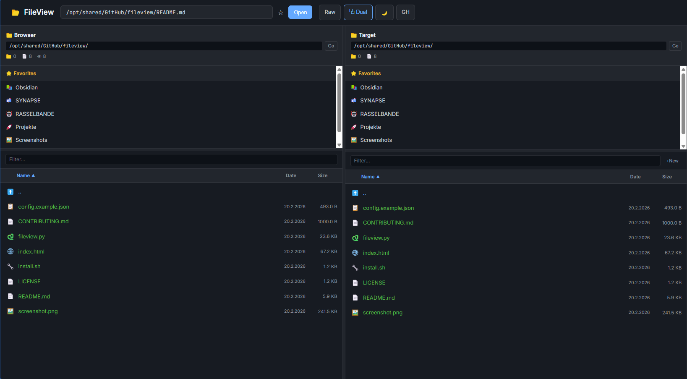

# FileView

Browse your files, read Markdown beautifully rendered, and view source code with syntax highlighting -- all from your browser. No install needed on client machines, just open a URL.


## What it does

FileView turns any Linux server into a web-based file browser. Point it at your directories and access them from any device on your network.

- **Read Markdown** as nicely formatted pages, with tables, code blocks, and a table of contents
- **View source code** with syntax highlighting for 30+ languages (Python, JavaScript, Rust, Go, and more)
- **Preview images** with EXIF metadata (camera model, dimensions, date taken)
- **Browse directories** with favorites, filtering, and sortable columns
- **Dual-panel mode** for comparing or copying between two directories -- like a file manager



## What makes it different

- **No build step.** The entire frontend is a single HTML file. Drop it on a server and go.
- **Dark and light theme.** Switch with one click. Your choice is remembered.
- **Resizable everything.** Column widths, panel splits, favorites height -- drag to adjust, all saved automatically.
- **Keyboard shortcuts.** `Ctrl+L` / `Ctrl+R` to jump to the path bar in either panel.
- **Path conversion.** Paste a Windows path like `V:\Documents\report.md` and it just works (if configured).
- **File operations.** Copy, move, rename, delete -- optional, disabled by default for safety.
- **Secure by default.** Only serves files from directories you explicitly allow. No accidental exposure.

## Getting started

```bash
git clone https://github.com/stlas/fileview.git
cd fileview

# Install dependencies
pip install flask flask-cors markdown pygments

# Configure
cp config.example.json config.json
# Edit config.json: set allowed_paths and default_directory

# Run
python3 fileview.py
```

Open `http://localhost:8080` in your browser.

For production use, run with [gunicorn](https://gunicorn.org/) instead of the built-in server:

```bash
pip install gunicorn
gunicorn fileview:app -b 0.0.0.0:8080 -w 4
```

## Configuration

All settings live in `config.json`:

```json
{
    "host": "0.0.0.0",
    "port": 8080,
    "title": "FileView",
    "allowed_paths": ["/srv/files", "/home/user/docs"],
    "default_directory": "/srv/files",
    "features": {
        "file_operations": false,
        "favorites": true,
        "path_conversion": null
    }
}
```

| Setting | Default | What it does |
|---------|---------|--------------|
| `title` | `FileView` | Name shown in the browser tab and header |
| `allowed_paths` | `[]` | Which directories FileView is allowed to read |
| `default_directory` | `/` | The directory shown when you first open FileView |
| `features.file_operations` | `false` | Allow copy, move, rename, delete via right-click menu |
| `features.favorites` | `true` | Show a favorites section (bookmarks saved in your browser) |
| `features.path_conversion` | `null` | Map a path prefix to another (e.g. Windows drive to Linux path) |
| `cors_origins` | `["http://192.168.178.*"]` | Which origins may access the API (for LAN use) |

### Path conversion example

If your users access files as `V:\` on Windows but the server stores them under `/srv/files/`:

```json
"path_conversion": {
    "from": "V:\\",
    "to": "/srv/files/"
}
```

Now pasting `V:\Documents\report.md` in the path bar opens `/srv/files/Documents/report.md`.

### Enabling file operations

Disabled by default for safety. To enable copy, move, rename, and delete:

```json
"features": {
    "file_operations": true
}
```

Right-click any file or folder to see the context menu. Both source and destination are checked against `allowed_paths`.

---

## Technical Reference

### Requirements

- Python 3.6+
- Flask + flask-cors
- markdown (Python package)
- Pygments (syntax highlighting)

```bash
pip install flask flask-cors markdown pygments
```

Optional: [Pillow](https://pillow.readthedocs.io/) for image dimensions and EXIF data.

### Supported file types

**Rendered as formatted HTML:**
`.md` (Markdown with GitHub-style rendering)

**Syntax highlighted:**
`.py` `.js` `.ts` `.tsx` `.jsx` `.sh` `.bash` `.json` `.yaml` `.yml` `.html` `.css` `.xml` `.sql` `.rs` `.go` `.java` `.c` `.cpp` `.h` `.rb` `.php` `.pl` `.lua` `.r` `.toml` `.ini` `.conf` `.env` `.diff` `.patch` `.bat` `.ps1` `.csv` `.log` `.txt` `.cfg` `.vim`

**Image preview:**
`.png` `.jpg` `.jpeg` `.gif` `.bmp` `.webp` `.svg` `.ico` `.tiff` `.tif`

Files without an extension (e.g. `Makefile`, `LICENSE`, `Dockerfile`) are displayed as plain text.

### API endpoints

| Method | Endpoint | Description |
|--------|----------|-------------|
| GET | `/` | Serve the frontend |
| GET | `/api/config` | Public configuration subset |
| GET | `/api/view?file=PATH` | Render a file (Markdown or syntax-highlighted) |
| GET | `/api/raw?file=PATH` | Raw file content as plain text |
| GET | `/api/browse?dir=PATH` | List directory contents as JSON |
| GET | `/api/check-path?path=PATH` | Check if a path exists and its type |
| GET | `/api/image?file=PATH` | Serve an image file |
| GET | `/api/image/info?file=PATH` | Image metadata (dimensions, EXIF) |
| POST | `/api/files/copy` | Copy file/directory (if enabled) |
| POST | `/api/files/move` | Move file/directory (if enabled) |
| POST | `/api/files/rename` | Rename file/directory (if enabled) |
| DELETE | `/api/files/delete` | Delete a file (if enabled) |

### Security

FileView enforces a path whitelist (`allowed_paths`). Every request is validated:

- Files outside `allowed_paths` return HTTP 403
- Symlinks are resolved before path checks -- no symlink escape
- Markdown HTML is sanitized (script, iframe, object, embed, event handlers stripped)
- File operations validate both source and destination
- Directory traversal (`../`) is normalized and checked
- CORS origins are configurable (defaults to LAN)
- No authentication -- intended for trusted LAN environments

**Do not expose FileView to the public internet without adding authentication.**

## License

Public Domain ([The Unlicense](https://unlicense.org)). Use it however you want.

## Credits

Created by [Stefan](https://github.com/stlas) and the [RASSELBANDE](https://github.com/stlas) -- a human-AI development team.
