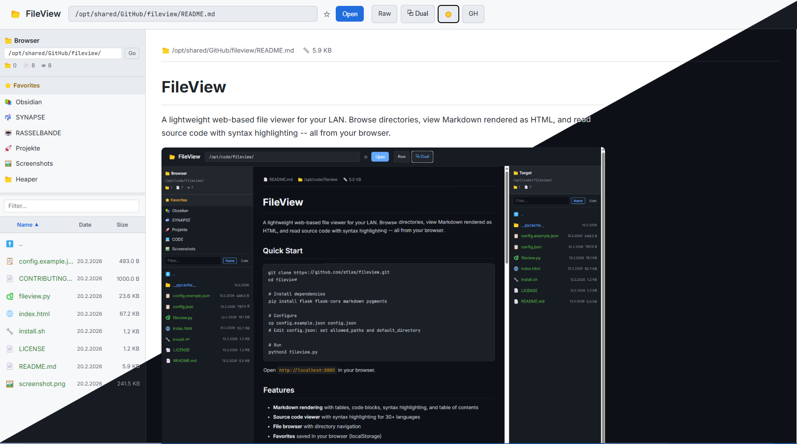

# FileView

A lightweight web-based file viewer for your LAN. Browse directories, view Markdown rendered as HTML, and read source code with syntax highlighting -- all from your browser.



## Quick Start

```bash
git clone https://github.com/stlas/fileview.git
cd fileview

# Install dependencies
pip install flask flask-cors markdown pygments

# Configure
cp config.example.json config.json
# Edit config.json: set allowed_paths and default_directory

# Run
python3 fileview.py
```

Open `http://localhost:8080` in your browser.

## Features

- **Markdown rendering** with tables, code blocks, syntax highlighting, and table of contents
- **Source code viewer** with syntax highlighting for 30+ languages
- **File browser** with directory navigation and resizable sidebar sections
- **Column headers** with click-to-sort (Name, Date, Size) and sort direction indicators
- **Resizable columns** -- drag column borders to adjust Date and Size widths
- **Favorites** with resizable section height, saved in your browser (localStorage)
- **Filter & Sort** files by name, date, or size via column headers
- **Dual-panel mode** (Total Commander style) -- two full-width file panels with resizable split
- **Image preview** with EXIF metadata display
- **Optional file operations** -- copy, move, rename, delete (disabled by default)
- **Path conversion** -- map Windows drive letters to Linux paths (e.g. `V:\` to `/srv/files/`)
- **Persistent layout** -- all column widths, panel splits, and section heights saved in localStorage
- **Dark theme** optimized for readability
- **Single-file frontend** -- just `index.html`, no build step
- **Path security** -- only serves files from configured allowed directories

## Configuration

All settings live in `config.json`:

```json
{
    "host": "0.0.0.0",
    "port": 8080,
    "title": "FileView",
    "allowed_paths": ["/srv/files", "/home/user/docs"],
    "default_directory": "/srv/files",
    "features": {
        "file_operations": false,
        "favorites": true,
        "path_conversion": null
    }
}
```

### Options

| Key | Default | Description |
|-----|---------|-------------|
| `host` | `0.0.0.0` | Bind address |
| `port` | `8080` | HTTP port |
| `title` | `FileView` | Browser title and header text |
| `allowed_paths` | `[]` | Directories the server is allowed to read (security!) |
| `default_directory` | `/` | Starting directory for the file browser |
| `features.file_operations` | `false` | Enable copy/move/rename/delete |
| `features.favorites` | `true` | Enable favorites (stored in browser localStorage) |
| `features.path_conversion` | `null` | Optional path mapping (see below) |
| `cors_origins` | `["http://192.168.178.*"]` | Allowed CORS origins (list of patterns) |

### Path Conversion

Map a Windows drive letter (or any prefix) to a Linux path:

```json
"path_conversion": {
    "from": "V:\\",
    "to": "/srv/files/"
}
```

Now users can paste `V:\Documents\report.md` in the path bar and it opens `/srv/files/Documents/report.md`.

### File Operations

Disabled by default for safety. Enable with:

```json
"features": {
    "file_operations": true
}
```

This adds right-click context menus for:
- **Rename** -- inline rename with extension preservation
- **Copy** -- copy to a target path (use dual-panel mode for easy targeting)
- **Move** -- move to a target path
- **Delete** -- single files only, with confirmation dialog

All operations are validated against `allowed_paths` on both source and destination.

## Supported File Types

### Rendered
- `.md` -- Markdown with full GitHub-style rendering

### Syntax Highlighted
`.py` `.js` `.ts` `.tsx` `.jsx` `.sh` `.bash` `.json` `.yaml` `.yml` `.html` `.css` `.xml` `.sql` `.rs` `.go` `.java` `.c` `.cpp` `.h` `.rb` `.php` `.pl` `.lua` `.r` `.toml` `.ini` `.conf` `.env` `.diff` `.patch` `.bat` `.ps1` `.csv` `.log` `.txt` `.cfg` `.vim`

Files without an extension (e.g. `Makefile`, `LICENSE`, `Dockerfile`) are displayed as plain text.

## API Endpoints

| Method | Endpoint | Description |
|--------|----------|-------------|
| GET | `/` | Serve the frontend |
| GET | `/api/config` | Public configuration subset |
| GET | `/api/view?file=PATH` | Render a file (Markdown or syntax-highlighted) |
| GET | `/api/raw?file=PATH` | Raw file content as plain text |
| GET | `/api/browse?dir=PATH` | List directory contents |
| GET | `/api/check-path?path=PATH` | Check if path exists and its type |
| GET | `/api/image?file=PATH` | Serve image file |
| GET | `/api/image/info?file=PATH` | Image metadata (dimensions, EXIF) |
| POST | `/api/files/copy` | Copy file/directory (if enabled) |
| POST | `/api/files/move` | Move file/directory (if enabled) |
| POST | `/api/files/rename` | Rename file/directory (if enabled) |
| DELETE | `/api/files/delete` | Delete a file (if enabled) |

## Requirements

- **Python 3.6+**
- **Flask** + flask-cors
- **markdown** (Python package)
- **Pygments** (for syntax highlighting via codehilite)

Install all at once:

```bash
pip install flask flask-cors markdown pygments
```

## Security

FileView enforces a path whitelist (`allowed_paths`). Every file and directory request is validated:

- Files outside `allowed_paths` return HTTP 403
- Symlinks are resolved (`realpath`) before path checks -- no symlink escape
- `/api/check-path` does not leak file existence outside allowed paths
- Markdown HTML is sanitized (script, iframe, object, embed, event handlers stripped)
- CORS origins are configurable (`cors_origins` in config.json, defaults to LAN)
- File operations validate both source and destination
- Directory traversal (`../`) is normalized and checked
- File operations are disabled by default
- No authentication -- intended for trusted LAN environments

**Do not expose FileView to the public internet without adding authentication.**

## License

Public Domain ([The Unlicense](https://unlicense.org)). Use it however you want.

## Credits

Built by the [RASSELBANDE](https://github.com/stlas) -- a collaborative AI development team.
